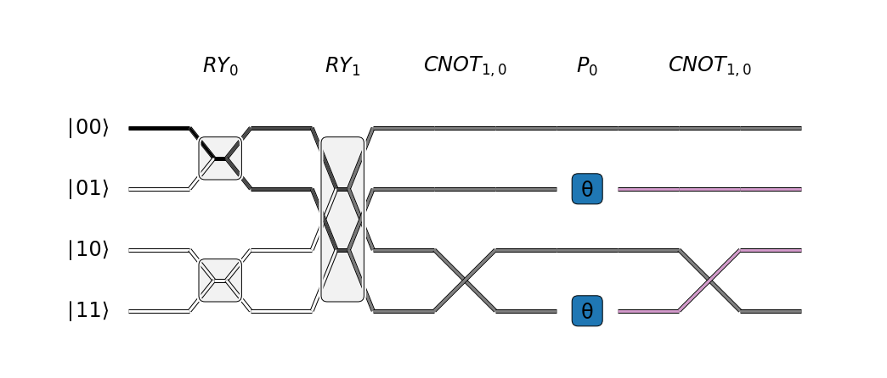
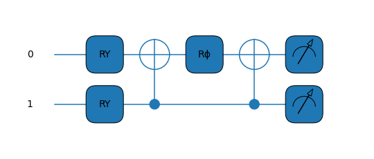
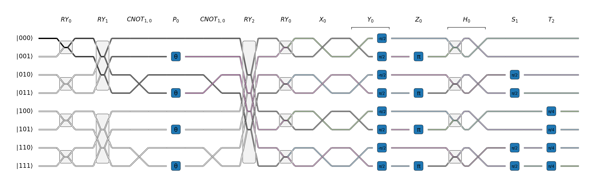

# Amplitude Flow Drawer

The Amplitude Flow Drawer visualizes a quantum circuit by drawing a wire for each
computational basis state. The wires carry the complex amplitudes associated to the basis
states by way of brightness (magnitude) and color (phase). Operations change the amplitudes
via 3 fundamental mechanims: amplitude transfer, wire permutations, and phase shifts.

The following visualization demonstrates the 3 mechanisms:



which corresponds to the circuit:



While the Amplitude Flow Drawer can be used by itself, it is also implemented as a PennyLane
device for automatic conversion of PennyLane circuits to amplitude flow diagrams.

## Installation

The drawer uses the Intel Quantum Simulator under the hood to simulate operations and query
the quantum state. The Python API requires pybind11 to be installed and available:

```bash
pip install pybind11-global
```

Then clone this repository and build the simulator via:

```bash
git clone https://github.com/dime10/amplitude-flow.git
cd amplitude-flow
git submodule init
git submodule update
mkdir intel-qs/build
cd intel-qs/build
CXX=g++ cmake -DIqsMPI=OFF -DIqsPython=ON ..
make
```

## Usage

From the root project directory:

```py
from amplitude_drawer import AmplitudeFlow
import pennylane as qml
import numpy as np

@qml.qnode(AmplitudeFlow(n_qubits=3, n_layers=31), interface=None)
def circuit():
    qml.RY(np.pi/2, wires=[0])
    qml.RY(np.pi/2, wires=[1])
    qml.CNOT(wires=[1, 0])
    qml.PhaseShift(np.pi/2, wires=[0])
    qml.CNOT(wires=[1, 0])
    qml.RY(np.pi/2, wires=[2])
    qml.RY(np.pi, wires=[0])
    qml.PauliX(wires=[0])
    qml.PauliY(wires=[0])
    qml.PauliZ(wires=[0])
    qml.Hadamard(wires=[0])
    qml.S(wires=[1])
    qml.T(wires=[2])
    return qml.probs()

circuit()
```


